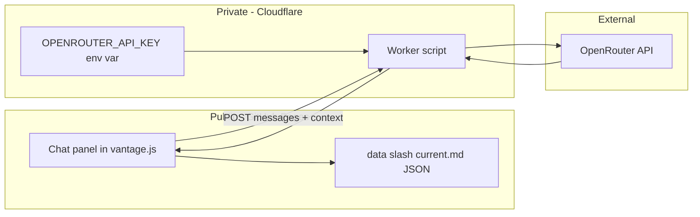

# VANTAGE / OVERSIGHT Live Chat — Setup Walkthrough

**Document purpose:** Step-by-step guide for adding an AI chat panel to the VANTAGE squad tracker, powered by **OpenRouter** and a **Cloudflare Worker** proxy.

**Audience:** Matticus / squad maintainer — no backend experience required.

**Status:** Planning & deployment guide. This document does **not** modify the live site by itself. After you complete the Cloudflare steps, ask VANTAGE in Cursor (Agent mode) to wire the chat UI into `assets/js/vantage.js`.

---

## Export this document as a PDF

1. Open this file in **Cursor**, **VS Code**, or paste into **Google Docs**.
2. **VS Code / Cursor:** install “Markdown PDF” extension → right-click this file → **Markdown PDF: Export (pdf)**.
3. **Browser:** open the rendered markdown on GitHub after push → Print → **Save as PDF**.
4. **Pandoc (CLI):** `pandoc VANTAGE_CHAT_SETUP_WALKTHROUGH.md -o VANTAGE_CHAT_SETUP.pdf`

---

## Table of contents

1. [What you are building](#1-what-you-are-building)
2. [Glossary — what is a “proxy”?](#2-glossary--what-is-a-proxy)
3. [Architecture overview](#3-architecture-overview)
4. [Prerequisites checklist](#4-prerequisites-checklist)
5. [Part A — OpenRouter setup](#5-part-a--openrouter-setup)
6. [Part B — Cloudflare Worker (the proxy)](#6-part-b--cloudflare-worker-the-proxy)
7. [Part C — Test the proxy before touching VANTAGE](#7-part-c--test-the-proxy-before-touching-vantage)
8. [Part D — What gets built in the VANTAGE repo](#8-part-d--what-gets-built-in-the-vantage-repo)
9. [Security rules (read this)](#9-security-rules-read-this)
10. [Costs & usage caps](#10-costs--usage-caps)
11. [Troubleshooting](#11-troubleshooting)
12. [Optional upgrades later](#12-optional-upgrades-later)
13. [Quick reference](#13-quick-reference)

---

## 1. What you are building

Today, **VANTAGE** is a static website (HTML + CSS + JS) published on **GitHub Pages**. Stats live in `data/<player>/<season>/current.md`. Coaching text is written by you in Cursor and stored in JSON inside those files.

You want a **chat window** on the site where users ask questions like:

- *“Who has the best Kaid win rate this season?”*
- *“What map should we stop queueing?”*
- *“How is Sandman doing on defense?”*

…and get answers **in VANTAGE or OVERSIGHT voice**, grounded in **real squad data** — not made-up ranks.

That requires:

| Piece | Role |
|-------|------|
| **Chat UI** | Button + panel on `oversight.html` (and optionally player dossiers) |
| **Squad context** | Current season JSON loaded the same way the site already does |
| **LLM API** | **OpenRouter** (you already use this with SillyTavern) |
| **Cloudflare Worker** | Hides your API key from the public internet |

---

## 2. Glossary — what is a “proxy”?

A **proxy** is a small program that sits **between** your website and OpenRouter.

```
  User browser                Cloudflare Worker              OpenRouter
  (GitHub Pages)              (your secret keeper)           (AI models)
       |                              |                            |
       |  "Ask about Sandman's Kaid"  |                            |
       | ---------------------------->|                            |
       |                              |  + API key (hidden)        |
       |                              | -------------------------->|
       |                              |                            |
       |                              |  <------ AI reply ----------|
       |  <-------- JSON reply -------|                            |
```

**Why you need it:** GitHub Pages only serves files. Anyone can read `vantage.js`. If you put your OpenRouter key in JavaScript, someone will steal it and spend your credits.

**What you do NOT need:** A full server, Raspberry Pi, or database for a first version.

---

## 3. Architecture overview



**Data flow for one message:**

1. User types a question in the chat panel.
2. `vantage.js` builds a **messages** array:
   - **System prompt** — VANTAGE/OVERSIGHT personality + squad JSON snapshot.
   - **User message** — the question.
3. Browser `fetch`es your Worker URL (no API key in the browser).
4. Worker adds `Authorization: Bearer <key>` and forwards to OpenRouter.
5. Worker returns the model’s reply to the browser.
6. Chat panel displays the answer.

---

## 4. Prerequisites checklist

Before you start, confirm you have:

- [ ] **VANTAGE site** on GitHub Pages (repo: `Vantage-2.0`)
- [ ] Your live URL (example: `https://<username>.github.io/Vantage-2.0/`)
- [ ] **OpenRouter account** — [https://openrouter.ai](https://openrouter.ai)
- [ ] **OpenRouter API key** (starts with `sk-or-...`)
- [ ] **Cloudflare account** (free) — [https://dash.cloudflare.com/sign-up](https://dash.cloudflare.com/sign-up)
- [ ] A credit card on OpenRouter **optional** but recommended for spending limits / paid models (many cheap models exist)

**You do not need:** Node.js installed, a VPS, or changes to your markdown data workflow.

---

## 5. Part A — OpenRouter setup

### Step A1 — Create or open your API key

1. Log in to [OpenRouter](https://openrouter.ai).
2. Go to **Keys** (or Account → API Keys).
3. Create a new key. Name it something like `vantage-chat`.
4. Copy the key once and store it in a password manager. **Do not commit it to Git.**

### Step A2 — Set a spending limit

1. In OpenRouter dashboard, find **Limits** / **Credits** / **Billing**.
2. Set a **monthly cap** you are comfortable with (e.g. $5–10 for a small squad).
3. This protects you if the Worker URL is ever abused.

### Step A3 — Pick a default model

OpenRouter uses model IDs like:

| Model ID | Notes |
|----------|--------|
| `anthropic/claude-3.5-haiku` | Fast, cheap, good for stat Q&A |
| `google/gemini-2.0-flash-001` | Very cheap, fast |
| `openai/gpt-4o-mini` | Solid general purpose |
| `meta-llama/llama-3.1-8b-instruct` | Budget option |

Browse current models: [https://openrouter.ai/models](https://openrouter.ai/models)

For VANTAGE stat questions, you do **not** need the most expensive model. Start with **Haiku** or **Flash**.

### Step A4 — Note OpenRouter’s API shape

Endpoint:

```http
POST https://openrouter.ai/api/v1/chat/completions
```

Headers:

```http
Authorization: Bearer YOUR_OPENROUTER_KEY
Content-Type: application/json
HTTP-Referer: https://your-site.github.io
X-Title: VANTAGE
```

Body (minimal):

```json
{
  "model": "anthropic/claude-3.5-haiku",
  "messages": [
    { "role": "system", "content": "You are VANTAGE..." },
    { "role": "user", "content": "Who leads on Tachanka win rate?" }
  ],
  "max_tokens": 800
}
```

This is the same family of API SillyTavern uses — you are already familiar with the concept.

---

## 6. Part B — Cloudflare Worker (the proxy)

### Step B1 — Create a Worker

1. Go to [Cloudflare Dashboard](https://dash.cloudflare.com).
2. Left sidebar → **Workers & Pages**.
3. Click **Create**.
4. Choose **Create Worker** (not Pages).
5. Name it something like `vantage-chat`.
6. Click **Deploy** (Cloudflare gives you a default “Hello World” script first).

You will get a URL like:

```text
https://vantage-chat.<your-subdomain>.workers.dev
```

Save this URL — the VANTAGE site will call it.

### Step B2 — Add your secret API key

1. Open your Worker → **Settings** → **Variables**.
2. Under **Environment Variables**, click **Add**.
3. Name: `OPENROUTER_API_KEY`
4. Value: paste your `sk-or-...` key.
5. Check **Encrypt** (recommended).
6. **Save and deploy.**

Never put this value in GitHub or in `vantage.js`.

### Step B3 — Replace the Worker script

1. Open your Worker → **Edit code**.
2. Delete the Hello World example.
3. Paste the script below.
4. **Edit the two placeholders** marked `YOUR_GITHUB_PAGES_ORIGIN`:
   - Use your exact GitHub Pages origin, e.g. `https://matthew.github.io`
   - If your site is at `https://user.github.io/Vantage-2.0/`, the origin is still `https://user.github.io` (no path).
5. Click **Save and deploy**.

#### Full Worker script (copy-paste starting point)

```javascript
/**
 * VANTAGE Chat Proxy — Cloudflare Worker
 * Forwards chat requests to OpenRouter without exposing the API key.
 */

const ALLOWED_ORIGIN = "https://YOUR_GITHUB_PAGES_ORIGIN.github.io";

const corsHeaders = {
  "Access-Control-Allow-Origin": ALLOWED_ORIGIN,
  "Access-Control-Allow-Methods": "POST, OPTIONS",
  "Access-Control-Allow-Headers": "Content-Type",
};

const DEFAULT_MODEL = "anthropic/claude-3.5-haiku";
const ALLOWED_MODELS = new Set([
  "anthropic/claude-3.5-haiku",
  "google/gemini-2.0-flash-001",
  "openai/gpt-4o-mini",
  "meta-llama/llama-3.1-8b-instruct",
]);

export default {
  async fetch(request, env) {
    if (request.method === "OPTIONS") {
      return new Response(null, { headers: corsHeaders });
    }

    if (request.method !== "POST") {
      return json({ error: "Method not allowed" }, 405);
    }

    if (!env.OPENROUTER_API_KEY) {
      return json({ error: "Server misconfigured: missing OPENROUTER_API_KEY" }, 500);
    }

    let body;
    try {
      body = await request.json();
    } catch {
      return json({ error: "Invalid JSON body" }, 400);
    }

    const messages = body.messages;
    if (!Array.isArray(messages) || messages.length === 0) {
      return json({ error: "messages array required" }, 400);
    }

    let model = body.model || DEFAULT_MODEL;
    if (!ALLOWED_MODELS.has(model)) {
      model = DEFAULT_MODEL;
    }

    const maxTokens = Math.min(Number(body.max_tokens) || 800, 1200);

    try {
      const upstream = await fetch("https://openrouter.ai/api/v1/chat/completions", {
        method: "POST",
        headers: {
          Authorization: `Bearer ${env.OPENROUTER_API_KEY}`,
          "Content-Type": "application/json",
          "HTTP-Referer": ALLOWED_ORIGIN,
          "X-Title": "VANTAGE",
        },
        body: JSON.stringify({ model, messages, max_tokens: maxTokens }),
      });

      const data = await upstream.json();

      return new Response(JSON.stringify(data), {
        status: upstream.status,
        headers: { ...corsHeaders, "Content-Type": "application/json" },
      });
    } catch (err) {
      return json({ error: "Upstream request failed", detail: String(err) }, 502);
    }
  },
};

function json(obj, status = 200) {
  return new Response(JSON.stringify(obj), {
    status,
    headers: { ...corsHeaders, "Content-Type": "application/json" },
  });
}
```

**What this script does:**

- Accepts **POST** only from your GitHub Pages origin (CORS).
- Validates that `messages` exists.
- Restricts models to a small allowlist (prevents abuse via expensive models).
- Forwards to OpenRouter with your encrypted env key.
- Returns OpenRouter’s JSON response unchanged.

### Step B4 — Local preview origin (optional)

While testing on `http://127.0.0.1:5500` (Live Server), the browser origin will **not** match GitHub Pages. Options:

1. **Temporarily** set `ALLOWED_ORIGIN` to `http://127.0.0.1:5500` while developing, then change back before going live.
2. Or use a second Worker variable `ALLOWED_ORIGIN` and read it from `env` instead of hardcoding.
3. Or test the Worker with `curl` / Postman first (no CORS), then test the full UI only on GitHub Pages.

---

## 7. Part C — Test the proxy before touching VANTAGE

Test with **curl** (replace URL and key path — key stays in Cloudflare, not in curl):

```bash
curl -X POST "https://vantage-chat.YOUR_SUBDOMAIN.workers.dev" \
  -H "Content-Type: application/json" \
  -d "{\"model\":\"anthropic/claude-3.5-haiku\",\"messages\":[{\"role\":\"user\",\"content\":\"Say hello in one sentence as a tactical coach.\"}]}"
```

**Success** looks like JSON with:

```json
{
  "choices": [
    {
      "message": {
        "role": "assistant",
        "content": "..."
      }
    }
  ]
}
```

**Common failures:**

| Symptom | Likely cause |
|---------|----------------|
| `401` from OpenRouter | Wrong or missing `OPENROUTER_API_KEY` in Worker env |
| CORS error in browser | `ALLOWED_ORIGIN` does not match your site URL |
| `405` | Using GET instead of POST |
| Empty `choices` | Model ID typo — check OpenRouter model list |

Only after curl works should you ask Cursor to wire the chat UI.

---

## 8. Part D — What gets built in the VANTAGE repo

*This section describes the website work — done in a future Cursor session, not by this markdown file.*

### Recommended rollout order

| Phase | Scope | Why |
|-------|--------|-----|
| **1** | OVERSIGHT only (`oversight.html`) | One page, full squad context, gold OVERSIGHT voice |
| **2** | Player dossiers | Page-aware context (single player JSON) |
| **3** | Streaming + polish | Typewriter effect, chat history, mobile layout |

### Files that would change (when you are ready)

| File | Change |
|------|--------|
| `assets/js/vantage.js` | Chat panel HTML, `fetch` to Worker, system prompt builder, context injection |
| `assets/css/vantage.css` | Chat drawer / modal styling (match command-deck aesthetic) |
| `oversight.html` | Optional: config constant for Worker URL |
| `workers/vantage-chat.js` | Optional: copy of Worker script stored in repo for version control (deploy still via Cloudflare UI or Wrangler CLI) |

### Config the site needs

Add a single constant (example):

```javascript
const VANTAGE_CHAT_ENDPOINT = "https://vantage-chat.YOUR_SUBDOMAIN.workers.dev";
```

**Do not** put the OpenRouter key in the repo — only the Worker URL.

### System prompt (concept)

The Worker does not know about Rainbow Six. **VANTAGE** builds the brain in the `system` message:

```text
You are VANTAGE — tactical coaching analyst for a seven-person R6 squad.
Use ONLY the JSON below for stats. If data is missing, say so. Never invent ranks or match results.
Address players by Discord display name. Tone: direct, tactical, part roast / part hype.
Never be cruel to the person — criticize the play.

SQUAD DATA (Y11S2):
{ ... compact JSON from all seven current.md files ... }
```

For **OVERSIGHT**, emphasize cross-roster comparison and gold command-deck tone.

For **player dossiers**, inject only that player’s `current.md` JSON plus optional operator reference snippets.

### What the chat UI might look like

- Floating button: `// OPEN CHANNEL` (gold on OVERSIGHT, purple on dossiers).
- Slide-out panel or modal (similar pattern to **Past comments** modal already in `vantage.js`).
- Text input + Send.
- Loading state: `// SYNTHESIZING REPLY…`
- Optional: “Clear conversation” button.

### Data the chat can answer well

- Ranks, RP, W/L, K/D, HS%, operator win rates, map records, badge counts.
- Comparisons across the seven players.
- Coaching-style reads **if** the stat supports it.

### What it may get wrong

- Predicting future performance.
- Operators/maps with tiny sample sizes (should caveat “low rounds”).
- Anything not in the loaded season JSON.

Always instruct the model: **cite the number or admit ignorance**.

---

## 9. Security rules (read this)

### DO

- Store `OPENROUTER_API_KEY` only in **Cloudflare Worker environment variables**.
- Restrict **CORS** to your real GitHub Pages origin.
- Use an **allowlist** of cheap models in the Worker.
- Set **spending caps** on OpenRouter.
- Rotate the API key if you suspect leakage.

### DO NOT

- Commit API keys to GitHub (including private repos — treat as compromised if pushed).
- Paste API keys into Cursor chat logs for permanent storage.
- Put keys in `vantage.js`, `index.html`, or screenshot them in Discord.
- Set `Access-Control-Allow-Origin: *` on the production Worker unless you accept public abuse.

### Optional squad gate

Add a shared password checked in the Worker:

```javascript
const token = request.headers.get("X-Squad-Token");
if (token !== env.SQUAD_TOKEN) return json({ error: "Unauthorized" }, 401);
```

Store `SQUAD_TOKEN` in Cloudflare env vars. Share the password only with the squad. Not foolproof, but stops casual scraping.

---

## 10. Costs & usage caps

Rough expectations for a **seven-person squad** chatting casually:

| Usage | Approximate cost |
|-------|------------------|
| 50 short questions / month on Haiku or Flash | Often under **$1** |
| Heavy daily use, longer context | **$5–15 / month** |
| Accidental key leak + bot abuse | **Unbounded** — use caps |

**Cloudflare Workers free tier** is typically enough for this traffic.

**OpenRouter:** add credits + hard limit in dashboard.

---

## 11. Troubleshooting

### Browser console: “CORS policy blocked”

- Worker `ALLOWED_ORIGIN` must exactly match the browser origin (scheme + host, no trailing path).
- GitHub Pages is always `https://`, never `http://`.

### Chat returns 502

- OpenRouter may be down or model ID invalid.
- Check Worker **Logs** (Cloudflare dashboard → Worker → Logs).

### Replies invent fake stats

- System prompt too weak or JSON context too large/truncated.
- Fix: send compact `meta` + `operators` + recent `matches` only; instruct “only use provided JSON”.

### Works on GitHub Pages but not Live Server

- CORS origin mismatch. Add localhost to allowed origin during dev or test on deployed site.

### “I want PDF / export chat”

- Future UI feature — not required for v1.

---

## 12. Optional upgrades later

| Feature | Effort | Notes |
|---------|--------|-------|
| **Streaming replies** (typewriter) | Medium | Worker returns SSE; Chart.js-style progressive UI |
| **Session memory** | Low | Keep last N messages in `sessionStorage` |
| **Per-page persona** | Low | VANTAGE on dossiers, OVERSIGHT on team page |
| **Wrangler CLI deploy** | Medium | Store Worker in repo; deploy from terminal instead of paste |
| **Custom domain** | Low | `chat.vantage.yourdomain.com` on Cloudflare |
| **Rate limit per IP** | Medium | Cloudflare Rate Limiting or KV counter |
| **Dokkaebi easter-egg replies** | Fun | Separate persona — don’t mix with official stats |

---

## 13. Quick reference

### Your URLs (fill in)

| Item | Your value |
|------|------------|
| GitHub Pages site | `https://________________.github.io/Vantage-2.0/` |
| Cloudflare Worker | `https://________________.workers.dev` |
| OpenRouter key location | Cloudflare env: `OPENROUTER_API_KEY` |
| Default model | `anthropic/claude-3.5-haiku` |

### Deployment checklist

- [ ] OpenRouter key created + spending cap set
- [ ] Cloudflare Worker deployed
- [ ] `OPENROUTER_API_KEY` set in Worker env (encrypted)
- [ ] `ALLOWED_ORIGIN` matches GitHub Pages
- [ ] curl test returns a valid `choices[0].message.content`
- [ ] Cursor Agent mode: wire chat UI + `VANTAGE_CHAT_ENDPOINT`
- [ ] Test on live GitHub Pages
- [ ] Push via GitHub Desktop (not CLI push required per your workflow)

### When you are ready to build the site side

Open Cursor → **Agent mode** → say something like:

> “Wire OVERSIGHT chat to my Worker at `https://vantage-chat.xxx.workers.dev`. VANTAGE voice, inject Y11S2 squad JSON, no API key in repo.”

VANTAGE will implement the panel in `vantage.js` / `vantage.css` using the patterns already used for charts and the comment modal.

---

*The high ground is reserved for those who earn it — and for squads who don’t leak their API keys.*

**Document version:** 2026-06-15 · VANTAGE TRAINING DIVISION
